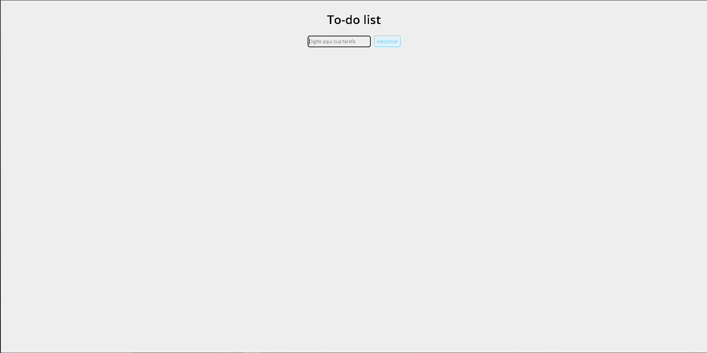
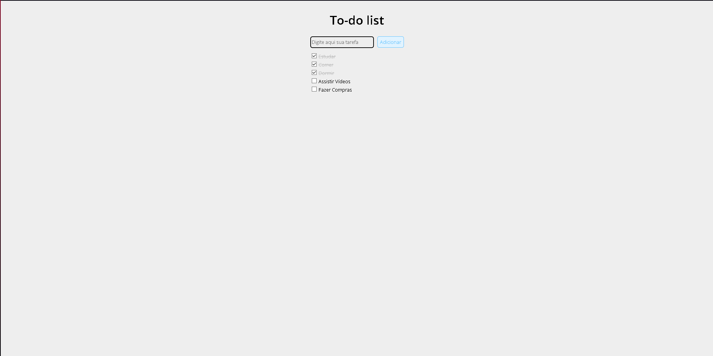

# To-Do-List

Uma **Lista de tarefas** feita em Javascript para relembrar algumas funcionalidades da linguagem.

Segue abaixo, algumas screenshots:

 - Página sem tarefas:

 - Páginas com tarefas:
